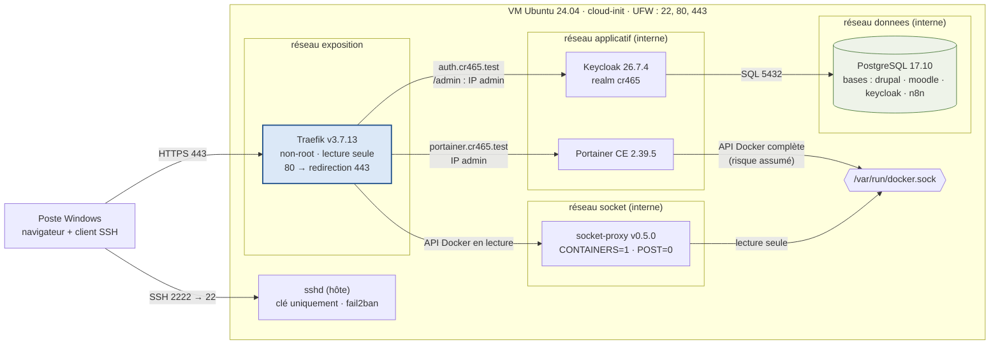
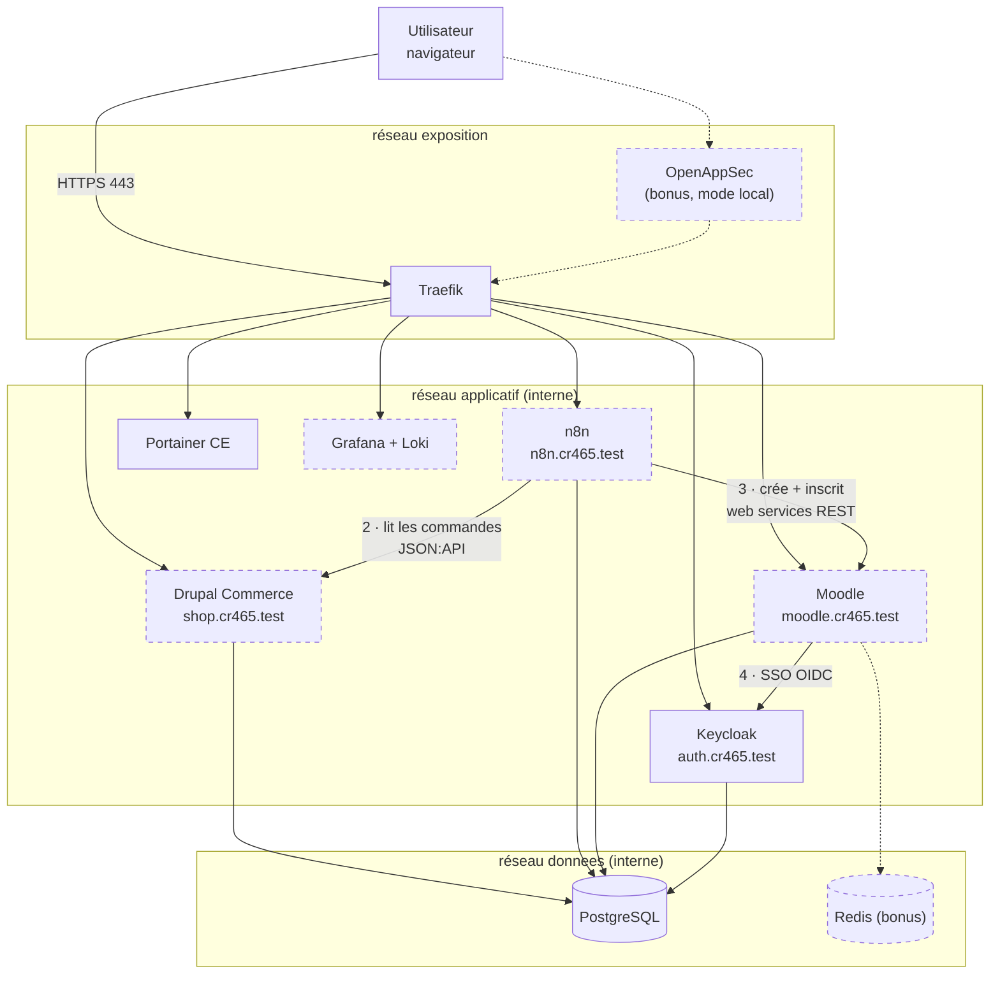
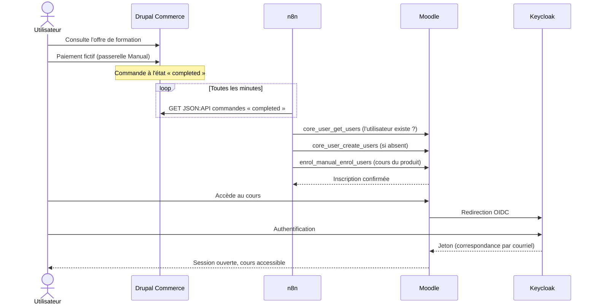

# Architecture de la plateforme CR465

> **Règle d'équipe :** ce fichier décrit ce qui est **réellement déployé** par
> `compose/docker-compose.yml`. Toute modification du Compose (service, réseau, port,
> middleware) doit être reportée ici dans la même pull request.
> Dernière mise à jour : 3 octobre 2026 — phases 1 et 2 terminées, Keycloak déployé.

## 1. Architecture déployée (état réel)

Seul Traefik est joignable depuis l'extérieur. Les autres services vivent sur des
réseaux Docker internes (`internal: true`), sans accès Internet.



Le tableau de bord Traefik (`traefik.cr465.test`) est un service interne à Traefik
(`api@internal`), protégé par liste d'IP et mot de passe.

## 2. Architecture cible (fin de projet)

Les éléments en pointillés ne sont pas encore déployés.



## 3. Parcours métier (cible)



## 4. Flux réseau autorisés (état réel)

| Source | Destination | Port / protocole | Réseau | Justification |
| --- | --- | --- | --- | --- |
| Poste client | Traefik | 80 → 8000 (redirigé), 443 → 8443 HTTPS | exposition | Seul point d'entrée web |
| Poste client | sshd (hôte) | 2222 → 22 SSH | hôte | Administration, clé uniquement |
| Traefik | Portainer | 9000 HTTP | applicatif | Routage `portainer.cr465.test` |
| Traefik | Keycloak | 8080 HTTP | applicatif | Routage `auth.cr465.test` |
| Traefik | socket-proxy | 2375 HTTP | socket | Découverte des conteneurs (lecture) |
| socket-proxy | socket Docker | Unix | hôte | Lecture seule, `POST=0` |
| Portainer | socket Docker | Unix | hôte | Gestion des conteneurs (risque assumé) |
| Keycloak | PostgreSQL | 5432 | donnees | Base `keycloak` |

## 5. Flux volontairement interdits

| Flux interdit | Mécanisme qui l'empêche |
| --- | --- |
| Internet → PostgreSQL | Aucun port publié, réseau `donnees` interne |
| Internet → Portainer / Keycloak en direct | Aucun port publié, réseau `applicatif` interne |
| Traefik → PostgreSQL | Traefik n'est pas sur le réseau `donnees` |
| Traefik → socket Docker brut | Passage obligatoire par socket-proxy (lecture seule) |
| Conteneurs → Internet | Réseaux `applicatif`, `donnees`, `socket` en `internal: true` |
| Console Keycloak `/admin` depuis une IP non autorisée | Middleware `admin-allowlist` |

## 6. Routeurs et middlewares Traefik

| Nom d'hôte | Service | Middlewares |
| --- | --- | --- |
| `traefik.cr465.test` | `api@internal` | `admin-allowlist`, `dashboard-auth`, `secure-headers` |
| `portainer.cr465.test` | Portainer :9000 | `admin-allowlist`, `secure-headers` |
| `auth.cr465.test` | Keycloak :8080 | `hsts` |
| `auth.cr465.test` + `/admin`, `/realms/master` | Keycloak :8080 | `admin-allowlist`, `hsts` |

Keycloak utilise `hsts` plutôt que `secure-headers`, car `frameDeny` bloquerait les
iframes de sa console d'administration.

## 7. Vérifier que le schéma correspond au réel

```bash
cd /opt/platform/repo/compose
docker compose ps --format 'table {{.Service}}\t{{.Image}}\t{{.Ports}}'
docker network inspect cr465_applicatif cr465_donnees cr465_socket cr465_exposition \
  --format '{{.Name}} internal={{.Internal}}: {{range .Containers}}{{.Name}} {{end}}'
```

La première commande ne doit montrer des ports publiés que pour Traefik. La seconde
liste les membres de chaque réseau : ils doivent correspondre aux sous-graphes du schéma 1.
